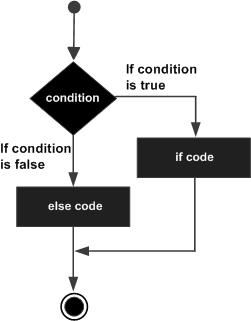

# if-else Statement

## Java if-else Statement

- In Java, the if else statement is used to execute two code blocks based on the given condition

## Syntax of if-else Statement in Java

```java
if(Boolean_expression) {
   // Executes when the Boolean expression is true
}else {
   // Executes when the Boolean expression is false
}
```

If the boolean expression evaluates to true, then the if block of code will be executed, `otherwise` else block of code will be executed.

## Flow Diagram of if-else Statement in Java



## Java if-else-if Statement

The if...else if...else statement is used for executing multiple code blocks based on the given conditions (Boolean expressions).

```java
if(Boolean_expression 1) {
   // Executes when the Boolean expression 1 is true
}else if(Boolean_expression 2) {
   // Executes when the Boolean expression 2 is true
}else if(Boolean_expression 3) {
   // Executes when the Boolean expression 3 is true
}else {
   // Executes when the none of the above condition is true.
}
```

## Java Nested if-else Statement

The nested if else statement is used for better decision-making when other conditions are to be checked when a given condition is true. In the nested if else statement, you can have an if-else statement block the another if (or, else) block.

```java
if(condition1){    
	// code block    
	if(condition2){  
		//code block
	}    
}
```

