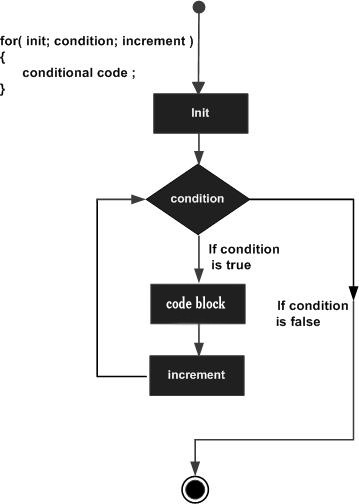

# Loop Control

## Java Loops

Java programming language provides the following types of loops to handle the looping requirements:

`1	while loop`
Repeats a statement or group of statements while a given condition is true. It tests the condition before executing the loop body.

`2	for loop`
Execute a sequence of statements multiple times and abbreviates the code that manages the loop variable.

`3	do...while loop`
Like a while statement, except that it tests the condition at the end of the loop body.

`4	Enhanced for loop`
As of Java 5, the enhanced for loop was introduced. This is mainly used to traverse collection of elements including arrays.

## Loop Control Statements

`1	break statement`
Terminates the loop or switch statement and transfers execution to the statement immediately following the loop or switch.

`2	continue statement`
Causes the loop to skip the remainder of its body and immediately retest its condition prior to reiterating.

## Java for Loop

### Flow Diagram



```java
for(initialization; Boolean_expression; update) {
   // Statements
}

// example
for(int x = 10; x < 20; x = x + 1) {
    System.out.print("value of x : " + x );
    System.out.print("\n");
}
```

### Java Infinite for Loop

```java
    int x = 10;
    for( ;; ) {
        System.out.print("value of x : " + x );
        x++;
        System.out.print("\n");
    }
```

## Java for-each Loop

### Syntax

```java
for(declaration : expression) {
   // Statements
}

// example
    List<Integer> numbers = Arrays.asList(10, 20, 30, 40, 50);

    for(Integer x : numbers ) {
        System.out.print( x );
        System.out.print(",");
    }
```