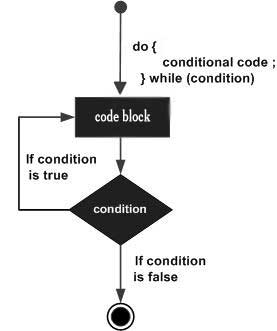

# Loop Control

## Java Loops

Java programming language provides the following types of loops to handle the looping requirements:

`1	while loop`
Repeats a statement or group of statements while a given condition is true. It tests the condition before executing the loop body.

`2	for loop`
Execute a sequence of statements multiple times and abbreviates the code that manages the loop variable.

`3	do...while loop`
Like a while statement, except that it tests the condition at the end of the loop body.

`4	Enhanced for loop`
As of Java 5, the enhanced for loop was introduced. This is mainly used to traverse collection of elements including arrays.

## Loop Control Statements

`1	break statement`
Terminates the loop or switch statement and transfers execution to the statement immediately following the loop or switch.

`2	continue statement`
Causes the loop to skip the remainder of its body and immediately retest its condition prior to reiterating.

## Java while Loop

> A while loop statement in Java programming language repeatedly executes a code block as long as a given condition is true.

### Syntax of do-while Loop

```java
do {
   // Statements
}while(Boolean_expression);

```

### Execution Process of a do-while Loop

- A do while loop is similar to a while loop, except that a do while loop is guaranteed to execute at least one time.


### Flow Diagram

