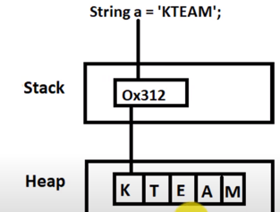

# VARIABLE

- Gán kiểu dữ liệu để xác định biến mang kiểu dữ liệu nào, kiểu dữ liệu là tập hợp những nhóm dữ liệu có chung đặc tính, cách lưu trữ và thao tác xử lí.
- Nhờ có kiểu dữ liệu compiler nhận biết được kích thước của một biến và khả năng lưu trữ của nó. Mục đích để lưu trữ và tái xử dụng.
  
Có 2 kiểu dữ liệu trong java:
- Kiểu dữ liệu nguyên thủy: có 8 kiểu dữ liệu nguyên thủy trong java
    - **Boolean**: giá trị là true hoặc false.
    - **Byte**: lưu trữ kiểu số nguyên kích cỡ là 1 byte (1 byte = 8 bit). Có giá trị lưu trữ từ -128 đến 127.
    - **Short**: lưu trữ kiểu số nguyên kích cỡ là 2 byte (16 bit). Giá trị có thể lưu từ -32,768 đến 32,767.
    - **Int**: lưu trữ kiểu số nguyên kích cỡ là 4 byte (32 bit). Gía trị có thế lưu từ -2,147,483,648 đến 2,147,483,647.
    - **Long**: lưu trữ kiểu số nguyên kích cỡ là 8 byte (64 bit). Gía trị có thể lưu từ … đến …
    - **Float**: lưu trữ kiểu số thực kích cỡ là 4 byte. Khi gán giá trị cần “f” phía sau.
    - **Double**: lưu trữ kiểu số thực kích cỡ là 8 byte. Khi gán giá trị có thể có hoặc không “d” ở phía sau.
    - **Char**: Kiểu dữ liệu để lưu trữ kí tự trong bảng Unicode

-	Kiểu dữ liệu tham chiếu
    - Kiểu dữ liệu tham chiếu là kiểu dữ liệu của đối tượng, biến của kiểu dữ liệu tham chiếu chỉ chứa địa chỉ của đối tượng tại bộ nhớ stack. Đối tượng dữ liệu lại nằm ở bộ nhớ Heap. Một số kiểu dữ liệu cụ thể như các mảng (Array), lớp đối tượng (Class) hoặc kiểu lớp giao tiếp (Interface) 



## Local variable

- Local variables are declared in `methods`, `constructors`, or `blocks`.
- Local variables are **created** when the method, constructor or block is entered and the variable will be **destroyed** once it exits the method, constructor, or block.

> `Access modifiers` cannot be used for local variables.

Example 1: Variable's local scope with initialization
```java
public class Test {
   public void pupAge() {
      int age = 0;
      age = age + 7;
      System.out.println("Puppy age is : " + age);
   }

   public static void main(String args[]) {
      Test test = new Test();
      test.pupAge();
   }
}
```

Example 2: Variable's local scope without initialization
```java
public class Test {
   public void pupAge() {
      int age; // Test.java:4:variable number might not have been initialized
      age = age + 7;
      System.out.println("Puppy age is : " + age);
   }

   public static void main(String args[]) {
      Test test = new Test();
      test.pupAge();
   }
}
```

## Java Instance Variables

- Instance variables are declared in a class, but **outside** a method, constructor or any block.
- Instance variables are `created` when an object is created with the use of the keyword 'new' and `destroyed` when the object is destroyed. (question)
- **Instance variables have default values**. For numbers, the default value is 0, for Booleans it is false, and for object references it is null. Values can be assigned during the declaration or within the constructor.
- Instance variables can be accessed directly by calling the variable name inside the class. However, within `static` methods (when instance variables are given accessibility), they should be called using the fully qualified name. ObjectReference.VariableName.

> `Instance` variables can be declared in class level before or after use.

```java
import java.io.*;

public class Employee {

   // this instance variable is visible for any child class.
   public String name;

   // salary  variable is visible in Employee class only.
   private double salary;

   // The name variable is assigned in the constructor.
   public Employee (String empName) {
      name = empName;
   }

   // The salary variable is assigned a value.
   public void setSalary(double empSal) {
      salary = empSal;
   }

   // This method prints the employee details.
   public void printEmp() {
      System.out.println("name  : " + name );
      System.out.println("salary :" + salary);
   }

   public static void main(String args[]) {
      Employee empOne = new Employee("Ransika");
      empOne.setSalary(1000);
      empOne.printEmp();
   }
}
```

## Java Class/Static Variables
- Class variables also known as static variables are declared with the `static keyword` in a class, but `outside` a method, constructor or a block.
- Static variables are `created` when the program starts and `destroyed` when the program stops.
- most static variables are declared `public` since they must be available for users of the class.
- **Default** values are same as instance variables. For numbers, the default value is 0; for Booleans, it is false; and for object references, it is null. Values can be assigned during the declaration or within the constructor. Additionally, values can be assigned in special static initializer blocks.

> Static variables can be accessed by calling with the class name ClassName.VariableName.


