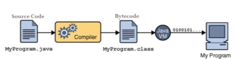

# COMPILER

**Compiler** hay còn gọi là trình biên dịch, là một chương trình có nhiệm vụ dịch các code của một ngôn ngữ lập trình thành một chương trình tương đương của ngôn ngữ cấp thấp hơn (thường là ngôn ngữ máy)

> Javac chính là  Compiler của Java sẽ dịch code Java sang mã bytecode, 

- Bytecode chính là vị trí trung gian giữa mà nguồn (ở đây là java) và mã máy (machine code). 
- Thông qua Java VM sẽ chuyển byte code sang mã máy để chạy chương trình.
  


## Hello word

### Public Main Class

```java
public class MyFirstJavaProgram {}
```

This line is creating a new class `MyFirstJavaProgram` and being public, this class is to be defined in the same name file as `MyFirstJavaProgram`.java. This convention helps *Java compiler* to identify the name of public class to be created before reading the file content.

### Public Static Void Main

```java
public static void main(String []args) {}
```

This line represents the main method that JVM calls when this program is loaded into memory. This method is used to execute the program. Once this method is finished, program is finished in single threaded environment.

### Compilation and Execution

- Trong Java, quá trình biên dịch (`compilation`) chạy trước quá trình thực thi (`execution`). Trong quá trình biên dịch, mã nguồn Java được biên dịch thành mã bytecode, sau đó mã bytecode này được thực thi bởi máy ảo Java (JVM) trong quá trình thực thi.

### Runtime

Trong lập trình, "`Runtime`" thường đề cập đến `môi trường thực thi của chương trình`, bao gồm các thư viện, biến môi trường và các tài nguyên hệ thống khác mà chương trình cần để chạy. Khái niệm "Runtime" không trực tiếp liên quan đến quá trình biên dịch (compilation) mà chỉ liên quan đến quá trình thực thi (execution) của chương trình. Runtime cung cấp môi trường để chương trình có thể thực thi và tương tác với hệ thống.
