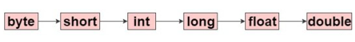
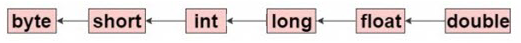

# CASTING

## Widening Casting (automatically)
- Việc chuyển đổi sẽ tự thực hiện bởi compiler và chúng ta không cần làm gì. 
- Việc chuyển đổi này gì dành cho kiểu dữ liệu nhỏ sang kiểu dữ liệu lớn hơn. Ta có thể xem chiều từ nhỏ sang lớn như sau:
  
```bash
byte > short > char > int > long > float > double
```


 
## Narrowing Casting (manually)

Ngược lại với cách chuyển đổi ngầm định, việc chuyển đổi tường minh là chiều ngược lại từ kiểu dữ liệu lớn hơn sang kiểu dữ liệu nhỏ hơn (với điều kiện giá trị đó kiểu dữ liệu sẽ thay đổi có thể lưu trữ được trong kiểu dữ liệu mới).
 

