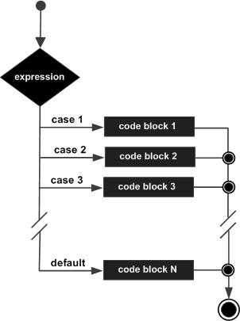

# switch Statement

> The Java switch statement allows a variable to be tested for equality against a list of values. Each value is called a case, and the variable being switched on is checked for each case.

## Syntax

```java
switch(expression) {
   case value :
      // Statements
      break; // optional
   
   case value :
      // Statements
      break; // optional
   
   // You can have any number of case statements.
   default : // Optional
      // Statements
}
```

## Flow Diagram

