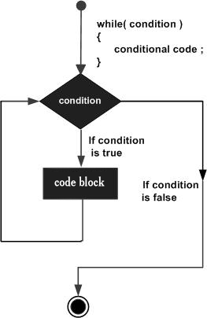

# Loop Control

## Java Loops

Java programming language provides the following types of loops to handle the looping requirements:

`1	while loop`
Repeats a statement or group of statements while a given condition is true. It tests the condition before executing the loop body.

`2	for loop`
Execute a sequence of statements multiple times and abbreviates the code that manages the loop variable.

`3	do...while loop`
Like a while statement, except that it tests the condition at the end of the loop body.

`4	Enhanced for loop`
As of Java 5, the enhanced for loop was introduced. This is mainly used to traverse collection of elements including arrays.

## Loop Control Statements

`1	break statement`
Terminates the loop or switch statement and transfers execution to the statement immediately following the loop or switch.

`2	continue statement`
Causes the loop to skip the remainder of its body and immediately retest its condition prior to reiterating.

## Java while Loop

> A while loop statement in Java programming language repeatedly executes a code block as long as a given condition is true.

### Syntax of while Loop

```java
while(Boolean_expression) {
   // Statements
}
```

### Execution Process of a while Loop

- Here, statement(s) may be a single statement or a block of statements. The condition may be any expression, and true is any non zero value.
- When executing, if the boolean_expression result is true, then the actions inside the loop will be executed. This will continue as long as the expression result is true.
- When the condition becomes false, program control passes to the line immediately following the loop.

### Flow Diagram

