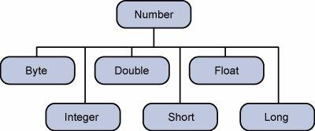

# Numbers Class

- Normally, when we work with Numbers, we use primitive data types such as byte, int, long, double, etc.

```java
int i = 5000;
float gpa = 13.65f;
double mask = 125;
```

- Sometimes, there may be some situations where we need to use objects instead of primitive data types. To achieve this, Java provides wrapper classes.
- All the wrapper classes (Integer, Long, Byte, Double, Float, Short) are subclasses of the abstract class Number.

## Java Number Class

> The Number class is an abstract class in java.lang package. It is the superclass of the classes that represent numeric values convertible to primitive data types such as byte, short, int, long, float, and double.



- The object of the wrapper class contains or wraps its respective primitive data type. Converting primitive data types into object is called boxing, and this is taken care by the compiler. 
- Therefore, while using a wrapper class you just need to pass the value of the primitive data type to the constructor of the Wrapper class.
- And the Wrapper object will be converted back to a primitive data type, and this process is called unboxing. The Number class is part of the java.lang package.


```java
public class Test {
   public static void main(String args[]) {
      Integer x = 5; // boxes int to an Integer object
      x =  x + 10;   // unboxes the Integer to a int
      System.out.println(x); 
   }
}
```

## Java Number Class Methods

1	byteValue()
This method returns the value of the specified number as a byte.

2	doubleValue()
This method returns the value of the specified number as a double.

3	floatValue()
This method returns the value of the specified number as a float.

4   intValue()
This method returns the value of the specified number as a int.

5   longValue()
This method returns the value of the specified number as a long.

6	compareTo()
Compares this Number object to the argument.

7	equals()
Determines whether this number object is equal to the argument.

8	valueOf()
Returns an Integer object holding the value of the specified primitive.

9	toString()
Returns a String object representing the value of a specified number.

10	parseInt()
This method is used to get the primitive data type of a certain String.

11	min()
Returns the smaller of the two arguments.

12	max()
Returns the larger of the two arguments.

## Java Number: Wrapper Classes

1   Boolean
The Java Boolean class wraps a value of the primitive type boolean in an object.

2	Byte
The Java Byte class wraps a value of the primitive type byte in an object.

3	Character
The Java Character class wraps a value of the primitive type char in an object.

4	Double
The Java Double class wraps a value of the primitive type double in an object.

5	Float
The Java Float class wraps a value of the primitive type float in an object.

6	Integer
The Java Integer class wraps a value of the primitive type int in an object.

7	Long
The Java Long class wraps a value of the primitive type long in an object.

8	Short
The Java Short class wraps a value of the primitive type short in an object.