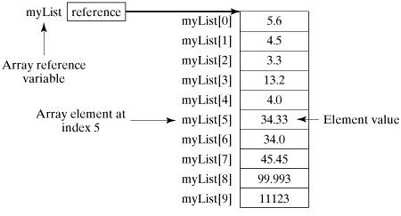

# Arrays

## What are Arrays in Java?

- Java provides a data structure called the array, which stores a fixed-size sequential collection of elements of the same data type. An array is used to store a collection of data, but it is often more useful to think of an array as a collection of variables of the same type.

- Instead of declaring individual variables, such as number0, number1, ..., and number99, you declare one array variable such as numbers and use numbers[0], numbers[1], and ..., numbers[99] to represent individual variables.

## Declaring Array Variables

To use an array in a program, you must declare a variable to reference the array, and you must specify the type of array the variable can reference. Here is the syntax for declaring an array variable −

### Syntax

```java
dataType[] arrayRefVar;   // preferred way.
or
dataType arrayRefVar[];  // works but not preferred way.
```

### Example

```java
double[] myList;   // preferred way.
or
double myList[];   // works but not preferred way.
```

## Creating Arrays

### Syntax

```java
arrayRefVar = new dataType[arraySize];

dataType[] arrayRefVar = new dataType[arraySize];

dataType[] arrayRefVar = {value0, value1, ..., valuek};
```

### Example

```java
double[] myList = new double[10]; // 10 is size of myList
```




## Processing Arrays

- When processing array elements, we often use either for loop or foreach loop because all of the elements in an array are of the same type and the size of the array is known.

```java
public class TestArray {

   public static void main(String[] args) {
      double[] myList = {1.9, 2.9, 3.4, 3.5};

      // Print all the array elements
      for (int i = 0; i < myList.length; i++) {
         System.out.println(myList[i] + " ");
      }
     
      // Summing all elements
      double total = 0;
      for (int i = 0; i < myList.length; i++) {
         total += myList[i];
      }
      System.out.println("Total is " + total);
      
      // Finding the largest element
      double max = myList[0];
      for (int i = 1; i < myList.length; i++) {
         if (myList[i] > max) max = myList[i];
      }
      System.out.println("Max is " + max);  
   }
}
```

### The foreach Loops with Arrays

```java
public class TestArray {

   public static void main(String[] args) {
      double[] myList = {1.9, 2.9, 3.4, 3.5};

      // Print all the array elements
      for (double element: myList) {
         System.out.println(element);
      }
   }
}
```

### Passing Arrays to Methods

```java
public static void printArray(int[] array) {
   for (int i = 0; i < array.length; i++) {
      System.out.print(array[i] + " ");
   }
}

printArray(new int[]{3, 1, 2, 6, 4, 2});
```

### Returning an Array from a Method

```java
public static int[] reverse(int[] list) {
   int[] result = new int[list.length];

   for (int i = 0, j = result.length - 1; i < list.length; i++, j--) {
      result[j] = list[i];
   }
   return result;
}
```

## The Arrays Class

**1	public static int binarySearch(Object[] a, Object key)**

Searches the specified array of Object ( Byte, Int , double, etc.) for the specified value using the binary search algorithm. The array must be sorted prior to making this call. This returns index of the search key, if it is contained in the list; otherwise, it returns ( – (insertion point + 1)).

**2	public static boolean equals(long[] a, long[] a2)**

Returns true if the two specified arrays of longs are equal to one another. Two arrays are considered equal if both arrays contain the same number of elements, and all corresponding pairs of elements in the two arrays are equal. This returns true if the two arrays are equal. Same method could be used by all other primitive data types (Byte, short, Int, etc.)

**3	public static void fill(int[] a, int val)**

Assigns the specified int value to each element of the specified array of ints. The same method could be used by all other primitive data types (Byte, short, Int, etc.)

**4	public static void sort(Object[] a)**

Sorts the specified array of objects into an ascending order, according to the natural ordering of its elements. The same method could be used by all other primitive data types ( Byte, short, Int, etc.)
