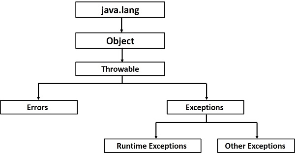

# Exceptions

## What Is an Exception in Java?

`An exception` is a problem that arises during the execution of a program. When an Exception occurs the normal flow of the program is disrupted and the program/Application terminates abnormally, which is not recommended, therefore, these exceptions are to be handled.

## Why Exception Occurs?

An exception can occur for many different reasons. Following are some scenarios where an exception occurs.
- A user has entered an invalid data.
- A file that needs to be opened cannot be found.
- A network connection has been lost in the middle of communications or the JVM has run out of memory.

> Some of these exceptions are caused by user error, others by programmer error, and others by physical resources that have failed in some manner.

## Java Exception Categories

Based on these, we have the following categories of Exceptions.'
- Checked exceptions
- Unchecked exceptions
- Errors

### Java Checked Exceptions

`A checked exception` is an exception that is checked (notified) by the compiler at compilation-time, these are also called as compile `time exceptions`. **These exceptions cannot simply be ignored, the programmer should take care of (handle) these exceptions.**

```java
import java.io.File;
import java.io.FileReader;

public class FilenotFound_Demo {

   public static void main(String args[]) {		
      File file = new File("E://file.txt");
      FileReader fr = new FileReader(file); 
   }
}

// C:\>javac FilenotFound_Demo.java
// FilenotFound_Demo.java:8: error: unreported exception FileNotFoundException; must be caught or declared to be thrown
//       FileReader fr = new FileReader(file);
```

### Java Unchecked Exceptions

- `An unchecked exception` is an exception that occurs at the **time of execution**. 
- These include programming bugs, such as logic errors or improper use of an API.
- **this exception is ignored at the time of compilation.**

```java
public class Unchecked_Demo {
   
   public static void main(String args[]) {
      int num[] = {1, 2, 3, 4};
      System.out.println(num[5]);
   }
}
```

### Errors

Đây hoàn toàn không phải là trường hợp exceptions mà là những vấn đề phát sinh ngoài tầm kiểm soát của người dùng hoặc lập trình viên. Lỗi thường bị bỏ qua trong mã của bạn vì bạn hiếm khi có thể làm bất cứ điều gì khi xảy ra lỗi. Ví dụ: nếu tràn ngăn xếp xảy ra, lỗi sẽ phát sinh. Chúng cũng bị bỏ qua  at the time of compilation.

> Trong Java, quá trình biên dịch (compilation) chạy trước quá trình thực thi (execution). Trong quá trình biên dịch, mã nguồn Java được biên dịch thành mã bytecode, sau đó mã bytecode này được thực thi bởi máy ảo Java (JVM) trong quá trình thực thi.



## Exception Handling in Java

### Try/catch
A method catches an exception using a combination of the` try and catch keywords`. A try/catch block is placed around the code that might generate an exception. Code within a try/catch block is referred to as protected code, and the syntax for using try/catch looks like the following −

```java
try {
   // Protected code
} catch (ExceptionName e1) {
   // Catch block
}

// Multiple Catch Blocks
try {
   // Protected code
} catch (ExceptionType1 e1) {
   // Catch block
} catch (ExceptionType2 e2) {
   // Catch block
} catch (ExceptionType3 e3) {
   // Catch block
} finally {
   // The finally block always executes.
}

// example
int a[] = new int[2];
try {
   System.out.println("Access element three :" + a[3]);
} catch (ArrayIndexOutOfBoundsException e) {
   System.out.println("Exception thrown  :" + e);
} finally {
   a[0] = 6;
   System.out.println("First element value: " + a[0]);
   System.out.println("The finally statement is executed");
}
```

### The try-with-resources

Nói chung, khi chúng ta sử dụng bất kỳ tài nguyên nào như streams, connections, v.v., chúng ta phải đóng chúng một cách rõ ràng bằng cách sử dụng khối cuối cùng. Trong chương trình sau, chúng ta đang đọc dữ liệu từ một tệp bằng FileReader và chúng ta sẽ đóng nó bằng khối cuối cùng.

```java
import java.io.File;
import java.io.FileReader;
import java.io.IOException;

public class ReadData_Demo {

   public static void main(String args[]) {
      FileReader fr = null;		
      try {
         File file = new File("file.txt");
         fr = new FileReader(file); char [] a = new char[50];
         fr.read(a);   // reads the content to the array
         for(char c : a)
         System.out.print(c);   // prints the characters one by one
      } catch (IOException e) {
         e.printStackTrace();
      }finally {
         try {
            fr.close();
         } catch (IOException ex) {		
            ex.printStackTrace();
         }
      }
   }
}
```

### Syntax

```java
try(FileReader fr = new FileReader("file path")) {
   // use the resource
   } catch () {
      // body of catch 
   }
```

### Example

```java
import java.io.FileReader;
import java.io.IOException;

public class Try_withDemo {

   public static void main(String args[]) {
      try(FileReader fr = new FileReader("E://file.txt")) {
         char [] a = new char[50];
         fr.read(a);   // reads the contentto the array
         for(char c : a)
         System.out.print(c);   // prints the characters one by one
      } catch (IOException e) {
         e.printStackTrace();
      }
   }
}
```

### The Throws/Throw Keywords
```java
public void divideNumbers(int a, int b) throws ArithmeticException {
    if (b == 0) {
        throw new ArithmeticException("Không thể chia cho 0");
    }
    int result = a / b;
}
```

## Java Exception Class Methods

1. `public String getMessage()`

Returns a detailed message about the exception that has occurred. This message is initialized in the Throwable constructor.

2. `public Throwable getCause()`

Returns the cause of the exception as represented by a Throwable object.

3. `public String toString()`

Returns the name of the class concatenated with the result of getMessage().

4. `public void printStackTrace()`

Prints the result of toString() along with the stack trace to System.err, the error output stream.

5. `public StackTraceElement [] getStackTrace()`

Returns an array containing each element on the stack trace. The element at index 0 represents the top of the call stack, and the last element in the array represents the method at the bottom of the call stack.

6. `public Throwable fillInStackTrace()`

Fills the stack trace of this Throwable object with the current stack trace, adding to any previous information in the stack trace.