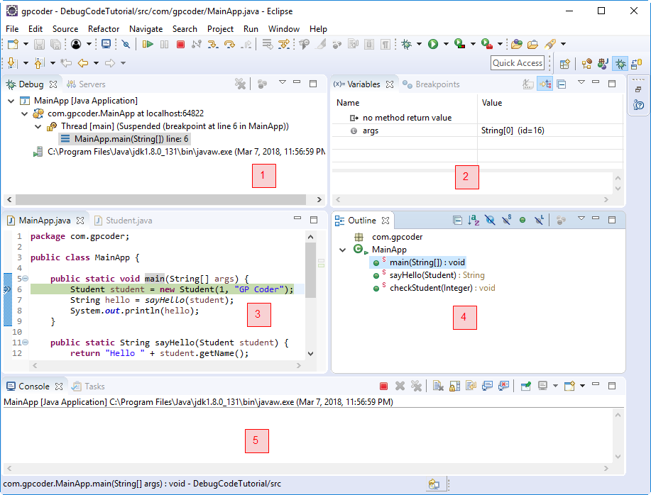
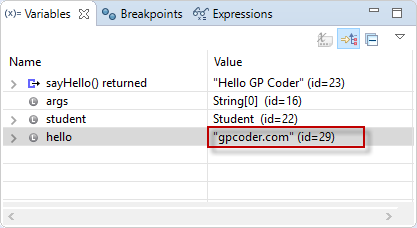

# Debugger

## Debug là gì?

Lỗi có thể do dự đoán của bạn đã bị sai hoặc là có gì đó phát sinh khi chương trình được thực thi mà bạn không lường trước được. Đôi khi chỉ cần nhìn vào source code là bạn tìm ra ngay nguyên nhân, nhưng khi cách đó không mang lại kết quả thì lúc này bạn cần phải Debug.

`Debug` (gỡ lỗi) là một kỹ năng nền tảng của lập trình viên. Mục đích chính của debug là để dò tìm lỗi (error) của chương trình, ngoài ra nó còn giúp lập trình viên hiểu rõ hơn cách chương trình hoạt động.

## Các phương pháp Debug

Có nhiều phương pháp để debug, thông thường chúng ta sử dụng các phương pháp sau:

`Print Console`: là cách thêm vào source code của bạn những dòng lệnh để in ra những thông tin mà bạn cần theo dõi trong quá trình thực thi. Ví dụ: System.out.println(), hay System.error.println(), … Cách này hơi phiền phức vì bạn phải thay đổi code của chương trình, những dòng code này vô nghĩa và sau khi debug bạn phải xóa khỏi source code của chương trình.

`Logging`: tạo ra một tập tin để ghi (log) lại những thông tin sau khi chương trình thực thi. Chúng ta sẽ dựa vào thông tin này để phân tích nguyên nhân lỗi. Kỹ thuật này thường được áp dụng trong môi trường thực, khi mà ứng dụng của bạn đang được mọi người sử dụng, bạn không thể thay đổi code hay sử dụng công cụ để dò tìm lỗi.

`Debugging Tool` (dùng công cụ để Debug) là phương pháp debug đi sâu vào source code nhất. Các công cụ này thông thường được tích hợp vào các IDE, ví dụ công cụ debugger của eclipse, Microsoft Visual Studio Debugger, … Cách này thường được sử dụng nhất khi bạn đang phát triển chương trình, bạn dễ dàng theo dõi, kiểm tra các giá trị, thay đổi các giá trị để kiểm tra tính đúng đắn của chương trình.

## Debug code Java trong Eclipse

`Debug` code Java trong `Eclipse` cũng giống như việc chạy một ứng dụng Java. Khi debug chúng ta có thể tạm ngưng (pause) chương trình để xem giá trị của các biến, từ đó biết được luồng chạy của chương trình, thậm chí là thay đổi giá trị của các biến. Đặc biệt debug được sử dụng để tìm kiếm bug, đây là một việc quan trọng trong phát triển phần mềm.

`BreakPoint` (điểm ngắt): một `BreakPoint` trong mã nguồn xác định nơi thực thi của chương trình nên dừng lại trong quá trình gỡ lỗi. Một khi chương trình đã dừng, bạn có thể kiểm tra giá trị các biến, thay đổi nội dung, …

## Các bước debug code Java trong Eclipse

Các bước thực hiện debug code trong Java:

- Tạo BreakPoint.
- Start chương trình ở chế độ Debug.
- Sử dụng các phím tắt để theo dõi giá trị các biến, theo dõi flow thực thi của chương trình.

## Code minh họa

```java
package com.gpcoder;
 
public class MainApp {
 
    public static void main(String[] args) {
        Student student = new Student(1, "GP Coder");
        String hello = sayHello(student);
        System.out.println(hello);
    }
 
    public static String sayHello(Student student) {
        return "Hello " + student.getName();
    }
 
    public static void checkStudent(Integer id) {
        if (id != null) {
            System.out.printf("Valid");
        } else {
            System.out.printf("Invalid");
        }
    }
}
```

### Tạo BreakPoint

Để xác định điểm ngắt trong mã nguồn, bạn nhấp chuột phải vào lề trái trong trình soạn thảo Java và chọn Toggle Breakpoint. Hoặc bạn có thể nhấp đúp vào vị trí cần đánh dấu BreakPoint.


Ví dụ tôi thiết lập một BreakPoint tại dòng code số 6, ta có kết quả sau:


### Start chương trình ở chế độ debug

Có thể thực hiện một trong các cách bên dưới để Start ở project ở chế độ debug trong Eclipse:

- Chọn menu Run -> Debug As -> Java Application.
- Click chuột phải vào class chứa phương thức main() -> Debug As -> Java Application.
- Nhấn phím F11.
- Click vào button Debug trong thanh công cụ -> Debug As -> Java Application.

Lần đầu tiên debug hộp thoại sau được hiển thị ra, check vào “Remember my decision” nếu bạn không muốn nhìn thấy nó lần nữa -> chọn Yes.

Nếu khung làm việc Debug không được mở, bạn có thể vào Window -> Perspective -> Open Perspective -> Others -> Debug.



Khung nhìn BreakPoint gồm có 5 cửa sổ nhỏ:

- Cửa sổ 1 (Debug): hiển thị thông tin Class của dòng lệnh đang thực thi.
- Cửa sổ 2 (Variables/ BreakPoints, Expressions): hiển thị giá trị các biến, hiển thị tất cả các BreakPoint đánh dấu của project, thiết lập các biểu thức (expression), điều kiện để đánh dấu BreakPoint.
- Cửa sổ 3 (Java Class): cho phép thực hiện điều khiển thực hiện debug.
- Cửa sổ 4 (Outline): hiển thị tên các biến, phương thức của class hiện đang thực thi, bạn có thể di chuyển nhanh đến vị trí của phương thức bằng cách click lên tên phương thức tương ứng.
- Cửa sổ 5 (Console): hiển thị thông tin kết quả của câu lệnh System.out, System.error, … ra cửa sổ Console.

### Các phím tắt để Debug Java project trong Eclipse


Eclipse cung cấp các nút trên thanh công cụ để kiểm soát việc thực hiện chương trình mà bạn đang debug. Bạn có thể sử dụng cho phép sử dụng phím tắt tương ứng để kiểm soát việc thực hiện này.

- `F5` (Step Into): nhảy vào phương thức đang debug.
- `F6` (Step Over): thực thi câu lệnh hiện tại và nhảy đến câu lệnh tiếp tiếp.
- `F7` (Step Return): thực thi câu lệnh hiện tại và quay lại lệnh đã gọi phương thức này.
- `F8` (Resume): thực thi câu lệnh hiện tại và nhảy đến breakpoint tiếp theo.
- `Ctrl` + F2 (Terminate): kết thúc chế độ debug.
- `Ctrl` + Shift + B: đánh dấu/ hủy BreakPoint
- `Ctrl` + Shift + I: mở popup hiển thị thông tin giá trị biến được chọn.

### Xem giá trị các biến trong khung debugger

Sau khi start chương trình ở chế độ debug, chương trình sẽ thực thi bình thường. Nếu gặp BreakPoint, chương trình sẽ dừng lại để cho phép bạn điều khiển và theo dõi. Như bạn thấy, chương trình sẽ dừng lại ở BreakPoint tại dòng code số 6:


Để xem giá trị của biến, bạn thực hiện một trong các cách sau:

- Hover chột vào biến tương ứng.
- Bôi đen biến và nhấn tổ hợp phím Ctrl + Shift + I.
- Mở cửa sổ Variable.

Tại dòng code số 7, bạn có thể nhấn phím F5 để vào xem nội dụng của phương thức sayHello.


Lưu ý: sau khi thực hiện debug xong, bạn có thể chuyển lại khung nhìn Java bằng cách click vào icon bên phải như sau:


### Thay đổi/ gán giá trị biến trong lúc debug

Ví dụ thực hiện debug chương trình trên đến dòng code số 8, khi đó giá trị hello tại cửa sổ Variables của khung nhìn Debug như sau:


Chúng ta có thể thay đổi giá trị của biến hello bằng cách nhấp chuột vào value của biến hello, sau đó nhập giá trị mới. Ví dụ, tôi đổi giá trị “GP Coder” thành “gpcoder.com“:



Nhấn phím F8 để chương trình thực thi tiếp phần còn lại. Tại cửa sổ Console, bạn sẽ thấy giá trị “gpcoder.com” được hiển thị:


### Xóa các BreakPoint hoặc hủy kích hoạt BreakPoint

Khung nhìn Breakpoints cho phép bạn xóa và hủy kích hoạt các BreakPoint. Để hủy kích hoạt một điểm ngắt, loại bỏ hộp kiểm tương ứng trong khung nhìn Breakpoints. Để xóa nó, bạn có thể sử dụng các nút tương ứng trong thanh công cụ.

Mở khung nhìn BreakPoint: Trên menu chính, chọn Window -> Show view -> Others -> BreakPoints


## Tham khao

<https://gpcoder.com/3621-huong-dan-debug-code-trong-eclipse/>