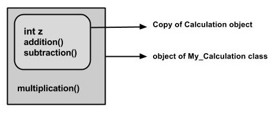
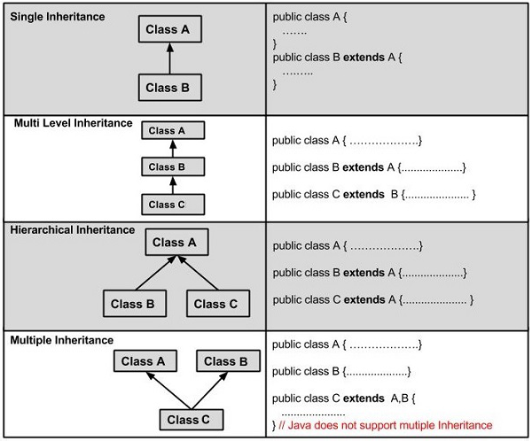

# Java Inheritance

Trong lập trình Java, kế thừa là một khái niệm quan trọng của Java OOP.

> Kế thừa là một quá trình mà một lớp có được các thuộc tính (phương thức và thuộc tính) của một lớp khác. Với việc sử dụng kế thừa, thông tin được quản lý theo thứ tự phân cấp.

Class kế thừa các thuộc tính của class khác được gọi là lớp con (child class) và class có các thuộc tính được kế thừa được gọi là superclass (parent class).

## Need of Java Inheritance

- **Code Reusability**: The basic need of an inheritance is to reuse the features. If you have defined some functionality once, by using the inheritance you can easily use them in other classes and packages.
- **Extensibility**: The inheritance helps to extend the functionalities of a class. If you have a base class with some functionalities, you can extend them by using the inheritance in the child class.
- **Cấy ghép ghi đè phương thức**: Kế thừa là cần thiết để đạt được một trong những khái niệm của Đa hình là ghi đè phương thức.
- **Đạt được tính trừu tượng**: Một khái niệm khác của OOP là tính trừu tượng cũng cần có sự kế thừa.

## Implementation of Java Inheritance

Để triển khai (sử dụng) kế thừa trong Java, từ khóa `extends` được sử dụng. Nó kế thừa các thuộc tính (thuộc tính hoặc/và phương thức) của lớp cơ sở cho lớp con. 

```java
class Super {
   
}
class Sub extends Super {
   
}
```

Java Inheritance Example

```java
class Calculation {
   int z;
	
   public void addition(int x, int y) {
      z = x + y;
      System.out.println("The sum of the given numbers:"+z);
   }
	
   public void Subtraction(int x, int y) {
      z = x - y;
      System.out.println("The difference between the given numbers:"+z);
   }
}

public class My_Calculation extends Calculation {
    public void multiplication(int x, int y) {
        z = x * y;
        System.out.println("The product of the given numbers:"+z);
    }
        
    public static void main(String args[]) {
        int a = 20, b = 10;
        My_Calculation demo = new My_Calculation();
        demo.addition(a, b);
        demo.Subtraction(a, b);
        demo.multiplication(a, b);

        // If you consider the above program, you can instantiate the class as given below. But using the superclass reference variable ( cal in this case) you cannot call the method multiplication(), which belongs to the subclass My_Calculation.
        Calculation demo = new My_Calculation();
        demo.addition(a, b);
        demo.Subtraction(a, b);
    }
}
```

In the given program, when an object to `My_Calculation` class is created, a copy of the contents of the superclass is made within it. That is why, using the object of the subclass you can access the members of a superclass.




The Superclass reference variable can hold the subclass object, but using that variable you can access only the members of the superclass, so to access the members of both classes it is recommended to always create reference variable to the subclass.

```java
   class Animal {
       void makeSound() {
           System.out.println("Animal sound");
       }
   }

   class Dog extends Animal {
       void makeSound() {
           System.out.println("Bark");
       }

       void wagTail() {
           System.out.println("Wagging tail");
       }
   }

   public class Main {
       public static void main(String[] args) {
           Animal myDog = new Dog(); // Biến tham chiếu của lớp cha giữ đối tượng của lớp con
           myDog.makeSound(); // Gọi phương thức của lớp cha (hoặc lớp con nếu được ghi đè)
           // myDog.wagTail(); // Lỗi biên dịch, không thể gọi phương thức của lớp con


            // RECOMMEND
            Dog myDog = new Dog();
            myDog.makeSound(); // Gọi phương thức của lớp con
            myDog.wagTail();   // Gọi phương thức của lớp con    
       }
   }
```

> **Note** − A subclass inherits all the members (fields, methods, and nested classes) from its superclass. `Constructors are not members`, so they are not inherited by subclasses, but the constructor of the superclass can be invoked from the subclass.

## Java Inheritance: The super Keyword

The `super` keyword is **similar to this keyword**. Following are the scenarios where the super keyword is used.

- Nó được sử dụng để phân biệt các thành viên của lớp cha với các thành viên của lớp con nếu chúng có cùng tên. (Sample Code 1)
- Nó được sử dụng để gọi `constructor` của lớp cha từ lớp con. (Sample Code 2)

### Differentiating the Members

If a class is inheriting the properties of another class. And if the members of the superclass have the names same as the sub class, to differentiate these variables we use super keyword as shown below.

```java
super.variable
super.method();
```

Sample Code 1

```java
class Super_class {
   int num = 20;

   // display method of superclass
   public void display() {
      System.out.println("This is the display method of superclass");
   }
}

public class Sub_class extends Super_class {
   int num = 10;

   // display method of sub class
   public void display() {
      System.out.println("This is the display method of subclass");
   }

   public void my_method() {
      // Instantiating subclass
      Sub_class sub = new Sub_class();

      // Invoking the display() method of sub class
      sub.display();

      // Invoking the display() method of superclass
      super.display();

      // printing the value of variable num of subclass
      System.out.println("value of the variable named num in sub class:"+ sub.num);

      // printing the value of variable num of superclass
      System.out.println("value of the variable named num in super class:"+ super.num);
   }

   public static void main(String args[]) {
      Sub_class obj = new Sub_class();
      obj.my_method();
   }
}
```

### Invoking Superclass Constructor

If a class is inheriting the properties of another class, the subclass automatically có được the default constructor of the superclass. But if you want to call a parameterized constructor of the superclass, you need to use the super keyword as shown below.

Sample Code 2

```java
class Superclass {
   int age;

   Superclass(int age) {
      this.age = age; 		 
   }

   public void getAge() {
      System.out.println("The value of the variable named age in super class is: " +age);
   }
}

public class Subclass extends Superclass {
   Subclass(int age) {
      super(age);
   }

   public static void main(String args[]) {
      Subclass s = new Subclass(24);
      s.getAge();
   }
}
```

## IS-A Relationship

IS-A is a way of saying: This object is a type of that object. Let us see how the extends keyword is used to achieve inheritance.

```java
public class Animal {
    public void eat() {
        System.out.println("Animal eats");
    }
}

// Động vật có vú
public class Mammal extends Animal {
    public void breathe() {
        System.out.println("Mammal breathes");
    }
}

public class Dog extends Mammal {
    public void bark() {
        System.out.println("Dog barks");
    }
}

public class Main {
    public static void main(String[] args) {
        Dog myDog = new Dog();
        myDog.eat();    // Gọi phương thức từ Animal
        myDog.breathe(); // Gọi phương thức từ Mammal
        myDog.bark();   // Gọi phương thức từ Dog
    }
}
```

Bây giờ, dựa trên ví dụ trên, theo thuật ngữ hướng đối tượng, những điều sau đây là đúng:

- Animal is the superclass of Mammal class.
- Animal is the superclass of Reptile class.
- Mammal and Reptile are subclasses of Animal class.
- Dog is the subclass of both Mammal and Animal classes.


Bây giờ, nếu chúng ta xem xét mối quan hệ IS-A, we can say −
 
- Mammal IS-A Animal
- Reptile IS-A Animal
- Dog IS-A Mammal
- Hence: Dog IS-A Animal as well

> Với việc sử dụng từ khóa extends, các lớp con sẽ có thể kế thừa tất cả các thuộc tính của lớp cha ngoại trừ các thuộc tính riêng tư của lớp cha.

## Java Inheritance: The instanceof Keyword

Chúng ta hãy sử dụng toán tử instanceof để kiểm tra xem Mammal có thực sự là một loài động vật hay không và dog có thực sự là một loài động vật hay không.

```java
interface Animal{}

class Mammal implements Animal{}

public class Dog extends Mammal {

   public static void main(String args[]) {
      Mammal m = new Mammal();
      Dog d = new Dog();

      System.out.println(m instanceof Animal);  // true
      System.out.println(d instanceof Mammal);  // true
      System.out.println(d instanceof Animal);  // true
   }
}
```

### Types of Java Inheritance



### Java Single Inheritance
 
Sự kế thừa đơn (hoặc, một cấp) kế thừa dữ liệu từ chỉ một lớp cơ sở cho chỉ một lớp dẫn xuất.

```java
class One {
  public void printOne() {
    System.out.println("printOne() method of One class.");
  }
}

public class Main extends One {
  public static void main(String args[]) {
    // Creating object of the derived class (Main)
    Main obj = new Main();

    // Calling method
    obj.printOne();
  }
}
```

### Java Multilevel Inheritance

Sự kế thừa trong đó một lớp cơ sở được kế thừa cho một lớp dẫn xuất và lớp dẫn xuất đó được kế thừa thêm cho một lớp dẫn xuất khác được gọi là kế thừa đa cấp. Kế thừa đa cấp liên quan đến nhiều lớp cơ sở.

```java
class One {
  public void printOne() {
    System.out.println("printOne() method of One class.");
  }
}

class Two extends One {
  public void printTwo() {
    System.out.println("printTwo() method of Two class.");
  }
}

public class Main extends Two {
  public static void main(String args[]) {
    // Creating object of the derived class (Main)
    Main obj = new Main();

    // Calling methods
    obj.printOne();
    obj.printTwo();
  }
}
```

### Java Hierarchical Inheritance

Sự kế thừa trong đó chỉ có một lớp cơ sở và nhiều lớp dẫn xuất được gọi là sự kế thừa phân cấp.

```java
// Base class
class One {
  public void printOne() {
    System.out.println("printOne() Method of Class One");
  }
}

// Derived class 1
class Two extends One {
  public void printTwo() {
    System.out.println("Two() Method of Class Two");
  }
}

// Derived class 2
class Three extends One {
  public void printThree() {
    System.out.println("printThree() Method of Class Three");
  }
}

// Testing CLass
public class Main {
  public static void main(String args[]) {
    Two obj1 = new Two();
    Three obj2 = new Three();

    //All classes can access the method of class One
    obj1.printOne();
    obj2.printOne();
  }
}
```

## Note

Trong Java, mặc dù chỉ cho phép kế thừa đơn (mỗi lớp chỉ có thể kế thừa từ một lớp cha duy nhất), nhưng việc cho phép kế thừa lồng (multilevel inheritance) vẫn có ý nghĩa và mang lại nhiều lợi ích. Dưới đây là một số lý do và giải thích cho việc này:

1. Cấu trúc Phân Cấp Rõ Ràng

Kế thừa lồng cho phép xây dựng một cấu trúc phân cấp rõ ràng và có tổ chức. Mỗi lớp có thể mở rộng và bổ sung các thuộc tính và phương thức của lớp cha mà không làm phức tạp hóa mối quan hệ giữa các lớp.

2. Tránh Kế Thừa Đa (Multiple Inheritance)

Java không hỗ trợ kế thừa đa (nơi một lớp có thể kế thừa từ nhiều lớp cha) để tránh các vấn đề phức tạp như "Diamond Problem" (vấn đề hình thoi).
Vấn đề này xảy ra khi một lớp kế thừa từ hai lớp cha có cùng một phương thức, gây khó khăn trong việc xác định phương thức nào sẽ được gọi.

3. Sự Đơn Giản và Dễ Hiểu

Kế thừa lồng giúp giữ cho mối quan hệ giữa các lớp đơn giản và dễ hiểu. Nếu một lớp có thể kế thừa từ nhiều lớp cha, điều này có thể dẫn đến sự phức tạp trong việc theo dõi và hiểu cách các lớp tương tác với nhau.

> Việc cho phép kế thừa lồng trong Java giúp duy trì tính đơn giản, rõ ràng và dễ bảo trì trong thiết kế hệ thống. Mặc dù có thể có những trường hợp mà kế thừa đa có vẻ gọn hơn, nhưng các vấn đề phức tạp mà nó mang lại thường không đáng để đánh đổi. Thay vào đó, Java khuyến khích việc sử dụng giao diện để đạt được tính linh hoạt và đa hình mà không cần phải đối mặt với những vấn đề phức tạp của kế thừa đa.