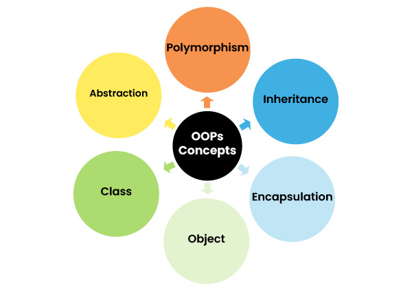

# OOP Concept

> Lập trình hướng đối tượng là một phương pháp hoặc mô hình để thiết kế chương trình bằng cách sử dụng các lớp và đối tượng. Nó đơn giản hóa việc phát triển và bảo trì phần mềm bằng cách cung cấp một số khái niệm.

## Object

- Trong lập trình hướng đối tượng, một `Object` là một thực thể có hai đặc điểm (states and behavior). 
- Một số `Object` trong thế giới thực là sách, điện thoại di động, bàn, máy tính, v.v.
- `Object` là một biến thuộc loại class, là thành phần cơ bản của hệ thống lập trình hướng đối tượng. 
- Một lớp có các phương thức và thành viên dữ liệu (thuộc tính), các phương thức và thành viên dữ liệu này được truy cập thông qua một `Object`. Do đó, một `Object` là một thể hiện của một lớp.

## Class

- Trong lập trình hướng đối tượng, một `Class` là một bản thiết kế mà từ đó các đối tượng riêng lẻ được tạo ra (hoặc chúng ta có thể nói một class là một kiểu dữ liệu của một kiểu đối tượng).
- Trong Java, mọi thứ đều liên quan đến các lớp và đối tượng. Mỗi lớp có các phương thức và thuộc tính riêng có thể được truy cập và thao tác thông qua các đối tượng.

## 4 Tính Chất Của Lập Trình Hướng Đối Tượng

### Tính kế thừa (Inheritance)
- Tính kế thừa cho phép xây dựng một lớp mới (lớp Con), kế thừa và tái sử dụng các thuộc tính, phương thức dựa trên lớp cũ (lớp Cha) đã có trước đó.
- Lớp con sẽ kế thừa tất cả các thành phần của lớp cha, nhờ sự chia sẻ này mới có thể mở rộng những đặc tính sẵn có mà không cần định nghĩa lại (khả năng tái sử dụng).

> Tính chất này được thể hiện qua: Extend, Super, Single Inheritance
 
### Tính đa hình (Polymorphism)
- Thuật ngữ "đa hình" có nghĩa là "nhiều dạng". Trong lập trình hướng đối tượng, đa hình hữu ích khi bạn muốn tạo nhiều dạng có cùng tên của một thực thể duy nhất.
- Quá trình nạp chồng phương thức được thực hiện trong cùng một lớp, trong đó chúng ta có nhiều phương thức có cùng tên nhưng tham số khác nhau, 
- Trong khi ghi đè phương thức được thực hiện bằng cách sử dụng tính kế thừa, trong đó chúng ta có thể có nhiều phương thức có cùng tên trong lớp cha và lớp con.

> Tính chất này được thể hiện qua: overriding, overloading, implement/extend (nhiều class/interface), dynamic binding, static binding, static

### Tính trừu tượng (Abstraction)
- Ví dụ thực tế về sự trừu tượng là một chiếc ô tô, các chi tiết bên trong như động cơ, quá trình khởi động ô tô, quá trình chuyển số, v.v. được ẩn khỏi người dùng và các tính năng như nút khởi động, số, màn hình, phanh, v.v. được cung cấp cho người dùng. 
- Khi chúng ta thực hiện bất kỳ hành động nào trên các tính năng này, quy trình bên trong sẽ hoạt động.
> Tính chất này được thể hiện qua các bài: abstract class, interface

### Tính đóng gói(Encapsulation)
- Tính chất này nhằm bảo về đối tượng không bị truy cập từ code bên ngoài vào để thay đổi giá trị các thuộc tính hoặc truy cập trực tiếp.
- Tính chất này giúp tăng tính bảo mật cho đối tượng và tránh tình trạng dữ liệu bị hư hỏng ngoài ý muốn.
> Tính chất này được thể hiện qua các bài: access modifier, setters, getters.

## Ưu điểm của Java OOP 
Sau đây là những ưu điểm của việc sử dụng OOP trong Java: 
- Việc triển khai các khái niệm OOP dễ dàng hơn. 
- Việc thực thi OOP nhanh hơn lập trình hướng thủ tục. 
- OOP cung cấp khả năng tái sử dụng mã để lập trình viên có thể tái sử dụng mã hiện có. 
- OOP giúp chúng ta giữ dữ liệu quan trọng được ẩn.