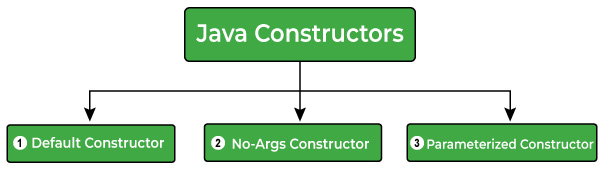

# Constructors

> `Java constructors` are special types of methods that are used to initialize an object when it is created. It has the same name as its class and is syntactically similar to a method. However, constructors have **no explicit return type.**

- Thông thường, bạn sẽ sử dụng một hàm tạo để cung cấp các giá trị ban đầu cho các biến thể hiện hoặc thực hiện bất kỳ quy trình khởi động nào khác cần thiết để tạo ra một đối tượng hoàn chỉnh.

- Tất cả các lớp đều có hàm tạo, bất kể bạn có định nghĩa hàm tạo hay không thì Java đều tự động cung cấp một hàm tạo mặc định, khởi tạo tất cả các biến thành viên. Tuy nhiên, sau khi bạn định nghĩa hàm tạo của mình, hàm tạo mặc định sẽ không còn được sử dụng nữa.

## Rules for Creating Java Constructors
- The name of the constructors must be the same as the class name.
- Java constructors do not have a return type. `Even do not use void as a return type.`
- There can be multiple constructors in the same class, this concept is known as constructor overloading.
- The access modifiers can be used with the constructors, use if you want to change the visibility/accessibility of constructors.
- Java provides a `default` constructor that is invoked during the time of object creation. If you create any type of constructor, the default constructor (provided by Java) is not invoked.

## Creating a Java Constructor

Syntax

```java
class ClassName {
   ClassName() {
   }
}
```

Example to create a Java Constructor

```java
public class Main {
  // Creating a constructor
  Main() {
    System.out.println("Hello, World!");
  }

  public static void main(String[] args) {
    System.out.println("The main() method.");

    // Creating a class's object
    // that will invoke the constructor
    Main obj_x = new Main();
  }
}
```

## Types of Java Constructors

There are three different types of constructors in Java, we have listed them as follows:

- Default Constructor
- No-Args Constructor
- Parameterized Constructor
  


### Default Constructor

> If you do not create any constructor in the class, Java provides a default constructor that initializes the object.

Example: Default Constructor (A Class Without Any Constructor)

```java
public class Main {
  int num1;
  int num2;

  public static void main(String[] args) {
    // We didn't created any structure
    // a default constructor will invoke here
    Main obj_x = new Main();

    // Printing the values
    System.out.println("num1 : " + obj_x.num1);
    System.out.println("num2 : " + obj_x.num2);
  }
}                    
```

### No-Args (No Argument) Constructor

> As the name specifies, the No-argument constructor does not accept any argument. By using the No-Args constructor you can initialize the class data members and thực hiện nhiều hành động khác nhau that you want on object creation.

Example: No-Args Constructor

```java
public class Main {
  int num1;
  int num2;

  // Creating no-args constructor
  Main() {
    num1 = -1;
    num2 = -1;
  }

  public static void main(String[] args) {
    // no-args constructor will invoke
    Main obj_x = new Main();

    // Printing the values
    System.out.println("num1 : " + obj_x.num1);
    System.out.println("num2 : " + obj_x.num2);
  }
}
```

### Parameterized Constructor

> A constructor with one or more arguments is called a parameterized constructor.

- Parameters are added to a constructor in the same way that they are added to a method, just declare them inside the parentheses after the constructor's name.

Example 1: Parameterized Constructor

```java
public class Main {
  int num1;
  int num2;

  // Creating parameterized constructor 
  Main(int a, int b) {
    num1 = a;
    num2 = b;
  }

  public static void main(String[] args) {
    // Creating two objects by passing the values 
    // to initialize the attributes.
    // parameterized constructor will invoke
    Main obj_x = new Main(10, 20);
    Main obj_y = new Main(100, 200);

    // Printing the objects values
    System.out.println("obj_x");
    System.out.println("num1 : " + obj_x.num1);
    System.out.println("num2 : " + obj_x.num2);

    System.out.println("obj_y");
    System.out.println("num1 : " + obj_y.num1);
    System.out.println("num2 : " + obj_y.num2);
  }
}
```

Example 2: Parameterized Constructor

```java
// A simple constructor.
class MyClass {
   int x;
   
   // Following is the constructor
   MyClass(int i ) {
      x = i;
   }
}
```

You would call constructor to initialize objects as follows −

```java
public class ConsDemo {
   public static void main(String args[]) {
      MyClass t1 = new MyClass( 10 );
      MyClass t2 = new MyClass( 20 );
      System.out.println(t1.x + " " + t2.x);
   }
}
```

## Constructor Overloading in Java

Constructor overloading means multiple constructors in a class. When you have multiple constructors with different parameters listed, then it will be known as constructor overloading.

```java
// Example of Java Constructor Overloading
// Creating a Student Class
class Student {
  String name;
  int age;

  // no-args constructor
  Student() {
    this.name = "Unknown";
    this.age = 0;
  }

  // parameterized constructor having one parameter
  Student(String name) {
    this.name = name;
    this.age = 0;
  }

  // parameterized constructor having both parameters
  Student(String name, int age) {
    this.name = name;
    this.age = age;
  }

  public void printDetails() {
    System.out.println("Name : " + this.name);
    System.out.println("Age : " + this.age);
  }
}

public class Main {
  public static void main(String[] args) {
    Student std1 = new Student(); // invokes no-args constructor
    Student std2 = new Student("Jordan"); // invokes parameterized constructor
    Student std3 = new Student("Paxton", 25); // invokes parameterized constructor

    // Printing details
    System.out.println("std1...");
    std1.printDetails();

    System.out.println("std2...");
    std2.printDetails();

    System.out.println("std3...");
    std3.printDetails();
  }
}
```