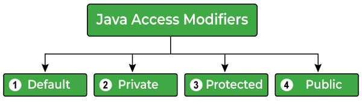
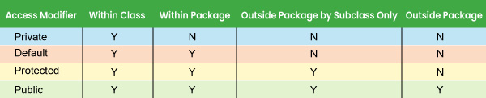

# Access Modifiers

> Java access modifiers are used to specify the scope of the variables, data members, methods, classes, or constructors. These help to restrict and secure the access (or, level of access) of the data.

There are four different types of access modifiers in Java, we have listed them as follows:

- Default (No keyword required)
- Private
- Protected
- Public



## Default Access Modifier

`Default access modifier` means we do not explicitly declare an access modifier for a class, field, method, etc.

> A variable or method declared without any access control modifier is available to any other class in the same package. The fields in an interface are `implicitly public` static final and the methods in an interface are by default public.

Example of Default Access Modifiers

```java
String version = "1.5.1";

boolean processOrder() {
   return true;
}
```

## Private Access Modifier

> Methods, variables, and constructors that are declared private can only be accessed within the declared class itself.

- Private access modifier is the most restrictive access level (mức truy cập hạn chế nhất.). Class and interfaces cannot be private.
- Variables that are declared private can be accessed outside the class, if public getter methods are present in the class.
- Using the private modifier is the main way that an object encapsulates itself (đóng gói) and hides data from the outside world.


Example 1:
```java
public class Logger {
    // Here, the format variable of the Logger class is private, so there's no way for other classes to retrieve or set its value directly.
    private String format;


    // So, to make this variable available to the outside world, we defined two public methods: getFormat(), which returns the value of format, and setFormat(String), which sets its value.
    public String getFormat() {
        return this.format;
    }

    public void setFormat(String format) {
        this.format = format;
    }
}
```

Example 2:
```java
class Logger {
  private String format;

  private String getFormat() {
    return this.format;
  }

  private void setFormat(String format) {
    this.format = format;
  }
}


public class Main {
  public static void main(String[] args) {
    // Creating an object 
    Logger log = new Logger();
    // Setting the value
    log.setFormat("Text");
    // Getting the value
    System.out.println(log.getFormat());


    // Main.java:18: error: setFormat(String) has private access in Logger
    // log.setFormat("Text");
  }
}
```

## Protected Access Modifier

> Variables, methods, and constructors, which are declared protected in a superclass can be accessed only by the subclasses in other package or any class within the package of the protected members' class.

- The protected access modifier cannot be applied to class and interfaces. Methods, fields can be declared protected,` however methods and fields in a interface cannot be declared protected.`
- Protected access gives the subclass a chance to use the helper method or variable, while preventing a nonrelated class from trying to use it.

```java
class AudioPlayer {
   protected boolean openSpeaker(Speaker sp) {
      // implementation details
   }
}

class StreamingAudioPlayer extends AudioPlayer {
   boolean openSpeaker(Speaker sp) {
      // implementation details
   }
}
```

## Public Access Modifier

A class, method, constructor, interface, etc. declared public can be accessed from any other class. Therefore, fields, methods, blocks declared inside a public class can be accessed from any class belonging to the Java Universe.

Syntax

```java
public static void main(String[] arguments) {
   // ...
}
```

Example of Public Access Modifiers

```java
// Class One
class One {
  public void printOne() {
    System.out.println("printOne method of One class.");
  }
}

public class Main {
  public static void main(String[] args) {
    // Creating an object of class One
    One obj = new One();

    // Calling printOne() method of class One
    obj.printOne();
  }
}
```

## Access Modifiers and Inheritance

The following rules for inherited methods are enforced −

> Methods declared public in a superclass also must be public in all subclasses.
> Methods declared protected in a superclass must either be protected or public in subclasses; they cannot be private.
> Methods declared private are not inherited at all, so there is no rule for them.

